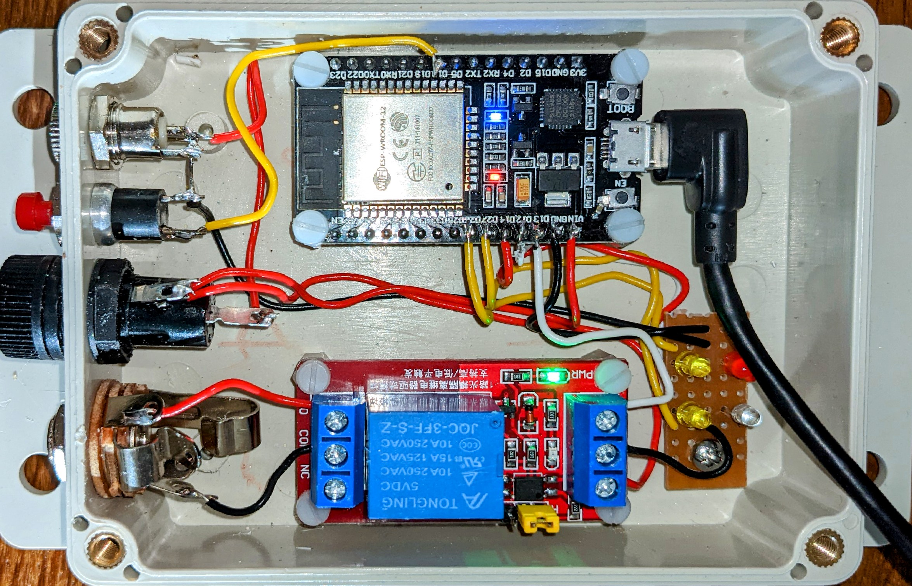

# Remote doorbell ringing over the network

_And what is a home made microcontroller project without blinking LEDs?_



## Purpose

We need to ring the doorbell in the outbuilding when the button in the main house is pressed. We're a WiFi noisy
environment with old big walls, and found (sadly) that short range links did not work. Unfortunately ESP-Now didn't
work either. I've not tried ESP Mesh though wonder if it will be similarly limited.

So we are left sending the signal over the house WiFi. This could have other uses, including ability to ring the doorbell on the PC. It has also been a learning experience for me setting up ESP32 networking and using Multicast.

## Hardware Required

* A development board with ESP32 SoC. I used the cheap DOIT kits available online
* I used a relay module to drive the bell. 
* Box, power, wiring.

I considered powering off the doorbell transformer, but found its internal resistance so high that its voltage dropped
considerably while the bell was ringing. I could keep the ESP32 alive using a large enough smoothing capacitor (1000uF was needed) but it did not seem reliable. The transformer is rated at 8V but has an open circuit voltage around 16V. This lead to huge voltage drop in the linear regulator while running the ESP32 at about 50mA, add a few more 20mA as I add in LEDs.

## User Configuration

The system enters configuarion mode on my build when the red button is held during boot. Hold the red button while applying power (or if the case is open hold the red button and press EN to reboot it). The red LED will light to indicate configuration mode. Run Mode is deliberately disabled for security reasons. You don't want to leave an open access point for too long, even if all it gives access to is a doorbell configuration page.

The ESP32 will run a WiFi hotspot. I've found that the web page is at http://192.168.4.1/ 
Enter details and press save. Then reboot into Run Mode. Look for the blue LED to shortly light up indicating WiFi connection made, then the green LED once contact is made with a suitable peer. (A button will look for a bell, a bell will look for a button.) The yellow LEDs indicate correctly formed packets transmitted and received, so both should be blinking periodically if all is working.

The web page is available in run mode and gives status information. Find the doorbell's address using your WiFI router.

## Compiling

```
idf.py menuconfig
idf.py flash
```

To monitor debug output

```
idf.py monitor
```

